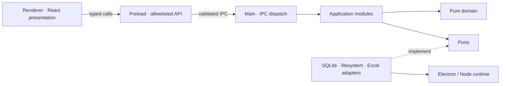
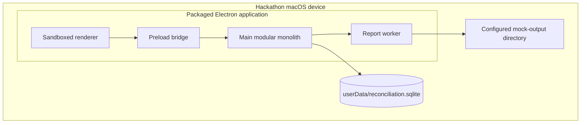
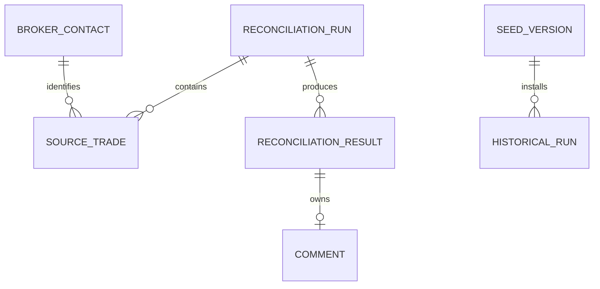

# Architecture Spine — Reconciliation Prototype

## Design Paradigm

**Process-isolated modular monolith.** The renderer is a sandboxed presentation process, the preload layer is a narrow typed boundary, and the main process contains application modules around a pure domain core. SQLite, filesystem, Electron, and Excel are replaceable adapters owned by main.



## Invariants & Rules

AD IDs are stable references, not a required reading order.

| Concern | Decisions |
| --- | --- |
| Process, boundaries, and ownership | AD-1–AD-4, AD-14, AD-27 |
| Domain, data integrity, and lifecycle | AD-5–AD-7, AD-18, AD-20–AD-22, AD-29–AD-30 |
| Reporting and background work | AD-8, AD-17, AD-28 |
| Security, testing, and deployment | AD-9, AD-12–AD-13 |
| Renderer state, UX, and accessibility | AD-10–AD-11, AD-15–AD-16, AD-19, AD-23–AD-26 |

### AD-1 — Process-isolated modular monolith

- **Binds:** All capabilities.
- **Prevents:** Features mixing privileged desktop work with renderer presentation.
- **Rule:** Renderer, preload, main application, domain, and adapters remain distinct layers; privileged work executes only in main or its worker.

### AD-2 — Inward dependency direction

- **Binds:** All source modules.
- **Prevents:** Domain logic becoming coupled to Electron, React, SQLite, files, or Excel.
- **Rule:** Dependencies point renderer → preload contract → main application → domain/ports. Adapters implement ports; domain imports no runtime or framework code.

### AD-3 — Main owns durable state

- **Binds:** FR-2, FR-5, FR-11, FR-14, FR-18, FR-19; NFR-5.
- **Prevents:** Competing persistence paths and renderer access to local resources.
- **Rule:** The privileged main-side boundary, including the narrowly tasked report worker it creates, is the only owner of SQLite and filesystem state. Renderer receives DTOs and owns only temporary view state.

### AD-4 — Schema-first IPC

- **Binds:** Every renderer/main interaction.
- **Prevents:** Channel, payload, error, and privilege drift between features.
- **Rule:** A shared Zod schema defines each versioned command/query and its result envelope. Preload exposes only named methods; main revalidates payload and sender. Never expose `ipcRenderer`, paths, SQL, or filesystem handles.

### AD-5 — Pure deterministic reconciliation

- **Binds:** FR-5–FR-7, FR-17–FR-18.
- **Prevents:** Status logic diverging across UI, persistence, report, and tests.
- **Rule:** One pure domain function accepts source Trades and returns canonical Reconciliation Results using the Reconciliation key defined in the PRD, stable Trade-ID ordinal pairing, exact normalized amount/quantity comparison, and canonical Status values. Source Trade IDs must be unique within `(Run ID, source)` or the Run fails before persistence.

### AD-6 — Command/query mutation rule

- **Binds:** FR-3–FR-19.
- **Prevents:** Hidden state mutation and stale renderer caches.
- **Rule:** Queries return immutable DTO snapshots. All writes use main application commands and transactions. A successful command returns either the changed DTO or the aggregate snapshot; renderer state is replaced with that returned value.

### AD-7 — Atomic run lifecycle

- **Binds:** FR-3–FR-7; NFR-5.
- **Prevents:** Duplicate active runs, partial results, and rerun overwrite.
- **Rule:** Main accepts at most one active reconciliation command. Each accepted run gets a new Run ID; the Runs module's Unit of Work commits the Run, source Trades, Results, and metrics in one transaction.

### AD-8 — Atomic verified workbook output

- **Binds:** FR-19.
- **Prevents:** Corrupt, partial, or overwritten Reports.
- **Rule:** Main's Report application service allocates a sibling temporary path. The worker writes and validates that temporary workbook; main verifies the worker receipt and atomically renames it to the collision-safe final path. Failure removes only the temporary file and preserves the Run.

### AD-9 — Secure Electron defaults are mandatory

- **Binds:** Application shell and every BrowserWindow.
- **Prevents:** Renderer compromise becoming local code or file access.
- **Rule:** Keep renderer sandbox and context isolation enabled, `nodeIntegration` disabled, CSP restricted to packaged local content, navigation/new windows blocked, and Electron fuses hardened for the packaged build.

### AD-10 — Typed failures and progress

- **Binds:** FR-2, FR-4, FR-14, FR-16, FR-19.
- **Prevents:** Feature-specific error semantics and destructive retry behavior.
- **Rule:** IPC returns `success(data)` or `failure(code, message, retryable, field?)`. Progress events contain Run ID, phase, completed, and total. Renderer retains user input until a success response replaces it.

### AD-11 — One semantic table system

- **Binds:** FR-8–FR-13; NFR-3–NFR-4, NFR-7.
- **Prevents:** Incompatible grid markup, keyboard models, and data behaviors.
- **Rule:** Results use one native semantic `<table>` powered by the pinned TanStack Table v9 release for client-side sort, filter, selection, and column visibility. Do not virtualize the 1,000-Result prototype fixture.

### AD-12 — Deterministic test seams

- **Binds:** All application services and acceptance tests.
- **Prevents:** Tests depending on wall time, OS paths, random identifiers, or dialogs.
- **Rule:** Clock, ID generator, fixture registry, database path, and report directory are injected ports with deterministic test implementations.

### AD-13 — Local deployment envelope

- **Binds:** NFR-1–NFR-2, NFR-5; packaging.
- **Prevents:** Accidental cloud, server, or machine-specific dependencies.
- **Rule:** Ship one packaged macOS desktop application, one SQLite file under Electron `userData`, versioned bundled fixtures, and a configured local mock-output directory. No server or network runtime dependency exists.

### AD-14 — Feature module ownership

- **Binds:** Main application structure.
- **Prevents:** One feature reaching into another feature's adapter or persistence details.
- **Rule:** Each main module owns its commands, queries, and mappings and calls other modules only through published application APIs. Run aggregate persistence ownership is defined by AD-27.

### AD-15 — Renderer state stays local and replaceable

- **Binds:** FR-1–FR-18.
- **Prevents:** Redux/Zustand/localStorage/IPC caches becoming competing sources of truth.
- **Rule:** View hooks load persisted DTOs; command responses replace them. Filter, sort, selection, inspector, navigation, and draft Comment state live in their owning feature. Add no second persistence or global state library.

### AD-16 — One visual token system

- **Binds:** NFR-2, NFR-3, NFR-6, NFR-7 and all renderer features.
- **Prevents:** Generic component skins or utility tokens overriding the approved UX.
- **Rule:** `tokens.css` is the sole design-token source and implements `DESIGN.md` plus system themes. Feature styling uses CSS Modules and shared semantic primitives; do not add a second UI or utility framework.

### AD-17 — Workbook work leaves the main event loop

- **Binds:** FR-19; NFR-1.
- **Prevents:** XLSX generation freezing Electron lifecycle and IPC handling.
- **Rule:** A Node worker thread receives a Zod-validated `RunReportV1` DTO plus one operation-scoped temporary output path. It validates the message again, writes and reopens the workbook, and returns a validated `WorkerReportReceiptV1` or typed failure. It receives no database handle, final path, or general path-discovery capability.

### AD-18 — Ordered schema and seed evolution

- **Binds:** FR-5, FR-18; NFR-5.
- **Prevents:** Seed resets and schema changes producing inconsistent databases.
- **Rule:** Apply ordered transactional migrations keyed by `PRAGMA user_version`. Import versioned seed fixtures only after migrations and only when that seed version is absent.

### AD-19 — Closed desktop navigation model

- **Binds:** FR-1, FR-7, FR-13.
- **Prevents:** URL routing and view state becoming competing navigation systems.
- **Rule:** Renderer navigation is a closed `AppView` union for Overview, Runs, and Exceptions plus an optional selected Run ID. Use no router library or URL-derived state.

### AD-20 — Decimal values never use binary-float equality

- **Binds:** FR-6, FR-8, FR-15, FR-19.
- **Prevents:** Financial mismatches caused by floating-point representation.
- **Rule:** Amount, quantity, and price cross boundaries and persist as normalized decimal strings. Shared domain helpers perform equality and ordering; display and workbook adapters alone format them.

### AD-21 — Workflow eligibility is enforced in main

- **Binds:** FR-11–FR-15, FR-19.
- **Prevents:** Renderer-only controls being bypassed or different modules applying different review rules.
- **Rule:** Before acting, main reloads authoritative persisted state and enforces these predicates: review is required only for `unmatched`; Comments are allowed only when Status is not `matched`; Broker Preview includes only the chosen Broker's unmatched Results; and Report Save is allowed only when every review-required Result is reviewed. `result.review.v1` sets `reviewed = true`; it never toggles.

### AD-22 — Seeded anomaly provenance

- **Binds:** FR-17–FR-18; NFR-5.
- **Prevents:** Demo reruns contaminating the baseline or modules calculating different warnings.
- **Rule:** Baseline is the arithmetic mean of exactly five seeded historical Unresolved rates and excludes user-created Runs. If fewer than five seeded historical Runs exist, the calculation returns `insufficient-history`. The five-percentage-point and two-times checks come from typed configuration and must both pass.

### AD-23 — Split Results Workspace is structural

- **Binds:** FR-8–FR-16; NFR-6–NFR-7.
- **Prevents:** Modal inspection, card-heavy layouts, or compressed unreadable columns.
- **Rule:** At demo width, the semantic Results table and persistent adjacent Detail Panel are visible together with the table holding visual priority. At constrained width, only the panel becomes an explicit inspector; selection and table context persist and required columns are never squeezed to unreadability.

### AD-24 — OS accessibility modes bind tokens

- **Binds:** NFR-2–NFR-3, NFR-6.
- **Prevents:** Manual theme state, inaccessible forced colors, and motion that ignores user settings.
- **Rule:** Tokens follow active OS light/dark without an app toggle, forced-colors mode maps essential UI to system colors, reduced-motion removes nonessential motion, and text/control/focus contrast meets the PRD's 4.5:1 and 3:1 floors.

### AD-25 — Focus and announcements follow one lifecycle

- **Binds:** FR-2–FR-4, FR-8–FR-16, FR-19; NFR-3–NFR-4.
- **Prevents:** Feature-specific focus jumps and conflicting live-region behavior.
- **Rule:** Row selection retains table focus. Opening the explicit constrained-width inspector moves focus to its heading; closing it restores focus to the invoker. Progress and success use polite announcements; errors are assertive and programmatically associated with the affected control.

### AD-26 — Interaction and recovery are in-place

- **Binds:** FR-1–FR-4, FR-9, FR-14, FR-16, FR-19; NFR-1, NFR-7.
- **Prevents:** Reloads or retries erasing task context.
- **Rule:** Navigation, theme, filtering, selection, and detail updates never reload the renderer. Retry retains selected Run, selected Result, focus context, and draft input. Report success returns and announces the saved destination.

### AD-27 — Runs module owns the aggregate and Unit of Work

- **Binds:** FR-5–FR-19; NFR-5.
- **Prevents:** Feature modules committing partial or incompatible views of a Run.
- **Rule:** `RunAggregate` contains Run metadata, source Trades, Results, review state, Comments, and computed metrics. Only `RunsRepository` and `RunsUnitOfWork` persist it. Reconciliation, Results, Comments, anomaly, Broker Preview, and Reports call the Runs application API rather than repositories directly.

### AD-28 — Report eligibility and contents share one snapshot

- **Binds:** FR-12, FR-15, FR-19.
- **Prevents:** A Report passing the review gate from one state but exporting another.
- **Rule:** `report.save.v1` opens one Runs read transaction, evaluates eligibility, and constructs an immutable `RunReportV1` from that same snapshot. The transaction closes before worker dispatch; later mutations affect only a later Report request.

### AD-29 — Ordering and retry semantics are deterministic

- **Binds:** FR-4–FR-6, FR-11, FR-14, FR-19.
- **Prevents:** Locale-dependent pairing, duplicate identity, and retry toggles.
- **Rule:** Trade IDs in fixtures and source records must match ASCII `[A-Za-z0-9_-]+`, sort in ascending bytewise ASCII order, and remain unique per source within a Run; duplicates fail with `DUPLICATE_TRADE_ID`. Mutation commands are set-to-value operations and return the resulting DTO, so identical retries are idempotent.

### AD-30 — Demo reset has one non-UI owner

- **Binds:** NFR-5.
- **Prevents:** Ad hoc deletion or a hidden business-user reset path.
- **Rule:** A documented `npm run demo:reset` entry point, executable only while the app is closed, invokes the bootstrap migration-and-seed service against the resolved prototype database path. It recreates database state and never deletes Reports.

## Consistency Conventions

| Concern | Convention |
| --- | --- |
| Entities and types | PascalCase singular: `ReconciliationRun`, `ReconciliationResult`, `SourceTrade`, `BrokerContact`. |
| Files | kebab-case; one public module entry point; React components PascalCase. |
| IPC channels | `area.action.v1`; commands use verbs, queries use `get`/`list`; progress uses `area.progress.v1`. |
| IDs | Opaque strings. Runtime IDs come from the injected `crypto.randomUUID` adapter; fixtures carry stable deterministic IDs. |
| Business dates | `YYYY-MM-DD`; timestamps are ISO 8601 UTC; presentation formatting happens only in renderer/report adapters. |
| Decimals | Canonical strings must not use exponent notation, a leading plus, a redundant leading zero, or a redundant trailing fractional zero. |
| Status | Only `matched`, `unmatched`, `missing-from-broker`, `missing-from-ot-murex`. |
| Result envelopes | Discriminated union on `ok`; failures expose stable code, safe message, retryability, and optional field. |
| Transactions | Application command owns the transaction; repositories never commit independently. |
| Eligibility | Shared domain predicates govern review, Comments, Broker Preview membership, and Report Save; renderer hints never replace main enforcement. |
| Logging | Structured main-process events with operation, code, Run ID/Result ID, and duration; never log Comment bodies or full Trades. |
| Configuration | Typed config resolved at bootstrap; features do not read environment variables or Electron paths directly. |

## Stack

| Name | Version |
| --- | --- |
| Electron | 43.4.0 |
| Bundled Node.js | 24.18.1 |
| Electron Forge | 7.11.2 |
| Vite | 8.2.1 |
| React | 19.2.8 |
| TypeScript | 7.0.2 |
| Zod | 4.4.3 |
| TanStack React Table | 9.1.2 |
| SQLite API | Node `node:sqlite` from Node 24.18.1 |
| ExcelJS | 4.4.0 |
| Vitest | 4.1.10 |
| Playwright | 1.62.1 |
| Package manager | npm with committed `package-lock.json` |

Exact installed versions are lockfile-owned after scaffold. Electron Forge's Vite plugin and Node's SQLite API are accepted prototype risks. Exact version pinning and the existing build/repository boundaries contain their change surface.

## Structural Seed

```text
src/
  domain/              # pure entities, decimal helpers, reconciliation, metrics
  shared/contracts/    # Zod IPC schemas and serializable DTOs
  main/
    bootstrap/         # window, config, migrations, seed, security
    ipc/               # schema-validating channel registration
    modules/           # runs, reconciliation, results, broker-preview, reports
    adapters/          # node:sqlite, filesystem, ExcelJS, clock, IDs
    workers/           # XLSX generation and validation
  preload/             # allowlisted contextBridge implementation
  renderer/
    app/               # AppView shell and view loading
    features/          # dashboard, runs, results, detail, broker preview, report
    components/        # shared semantic primitives
    styles/            # DESIGN.md tokens and global foundations
fixtures/              # immutable versioned scenarios and five-run baseline
migrations/            # ordered SQLite migrations
scripts/               # app-closed demo reset using bootstrap services
tests/                 # unit, contract, integration, Electron acceptance
```

### Runtime topology



### Core ownership



### Typed boundary surface

| Kind | Contract | Owner |
| --- | --- | --- |
| Query | `dashboard.get.v1`, `runs.list.v1`, `run.workspace.get.v1` | Main modules |
| Command | `reconciliation.run.v1`, `result.review.v1`, `comment.save.v1`, `broker.preview.v1`, `report.save.v1` | Main modules |
| Event | `reconciliation.progress.v1`, `report.progress.v1` | Main operation that started it |
| DTO | Dashboard, Run summary, workspace, Result detail, Broker draft, Report receipt | Shared contracts; populated by main |

## Capability → Architecture Map

| Capability / Area | Lives in | Governed by |
| --- | --- | --- |
| Shell, Dashboard, run start (FR-1–FR-4) | `renderer/app`, dashboard feature, runs module | AD-3, AD-4, AD-7, AD-19 |
| Seeded reconciliation (FR-5–FR-7) | domain reconciliation, Runs module, SQLite adapter | AD-2, AD-5, AD-7, AD-18, AD-20, AD-27, AD-29 |
| Results and review (FR-8–FR-12) | results feature, Runs module, shared table primitive | AD-6, AD-11, AD-15, AD-20–AD-21, AD-23, AD-27, AD-29 |
| Detail and Comments (FR-13–FR-14) | detail feature, results module | AD-3, AD-6, AD-10, AD-15, AD-21, AD-23, AD-25–AD-26 |
| Broker preview (FR-15–FR-16) | broker-preview feature/module | AD-4, AD-10, AD-14, AD-21, AD-26 |
| Summary and anomaly (FR-17–FR-18) | domain metrics, runs module, SQLite adapter | AD-5, AD-18, AD-20, AD-22 |
| Report (FR-19) | reports module, Runs snapshot API, report worker, Excel/filesystem adapters | AD-8, AD-10, AD-17, AD-21, AD-26–AD-29 |
| Theme, accessibility, layout (NFR-2–NFR-4, NFR-6–NFR-7) | renderer primitives and styles | AD-11, AD-16, AD-23–AD-26 |
| Performance and persistence (NFR-1, NFR-5) | bootstrap, Runs module, adapters, worker, reset script | AD-3, AD-7, AD-12, AD-13, AD-17–AD-18, AD-27–AD-30 |

## Deferred

- **Production data adapters:** Outlook, OT/MUREX, broker attachments, and network shares wait until mock workflow validation is complete.
- **VBA parity:** mapping migration and tolerance rules remain outside this prototype; revisit only with VBA fixtures and signed expected outputs.
- **Production identity and multi-user concurrency:** revisit before any shared or regulated deployment.
- **Windows packaging and code signing:** revisit if the pitch must run on Windows; OS behavior remains behind Electron and filesystem ports.
- **Large-result virtualization or server-side table operations:** revisit only after measured fixtures exceed the 1,000-Result acceptance size.
- **SQLite implementation swap:** reassess Node `node:sqlite` maturity before production; the repository port permits replacement without domain or renderer changes.
- **Email delivery and historical analytics:** explicitly excluded by the PRD; their future modules must use the same application and IPC boundaries.
